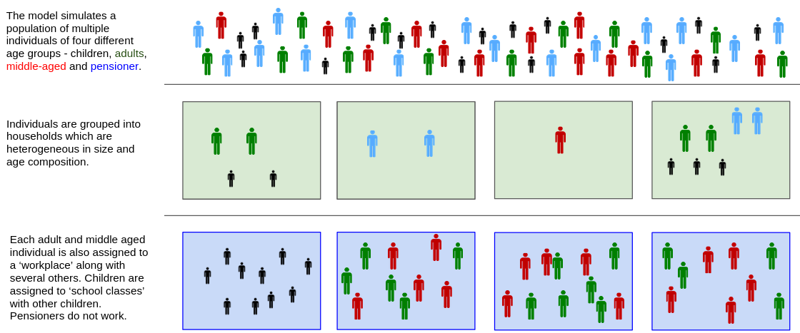
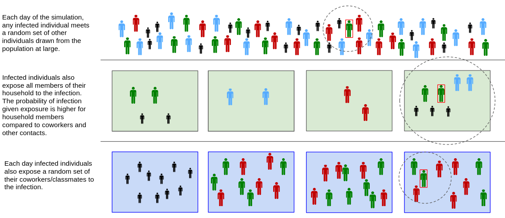
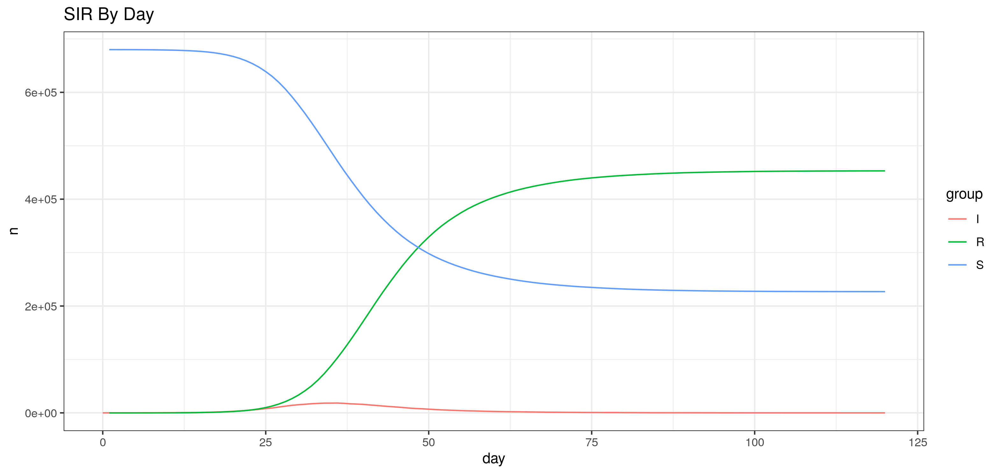
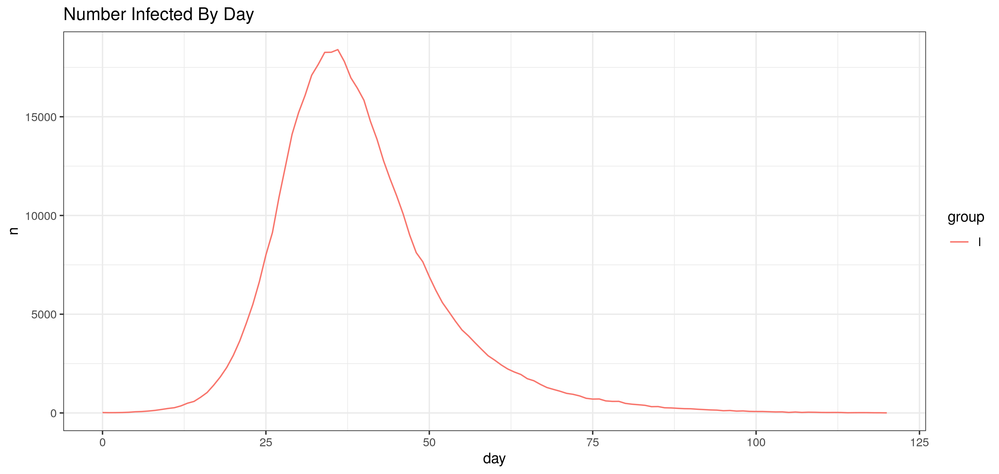
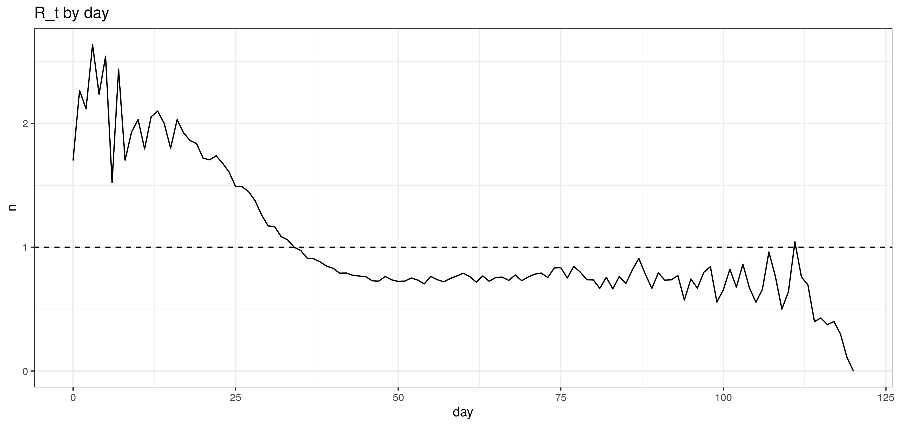
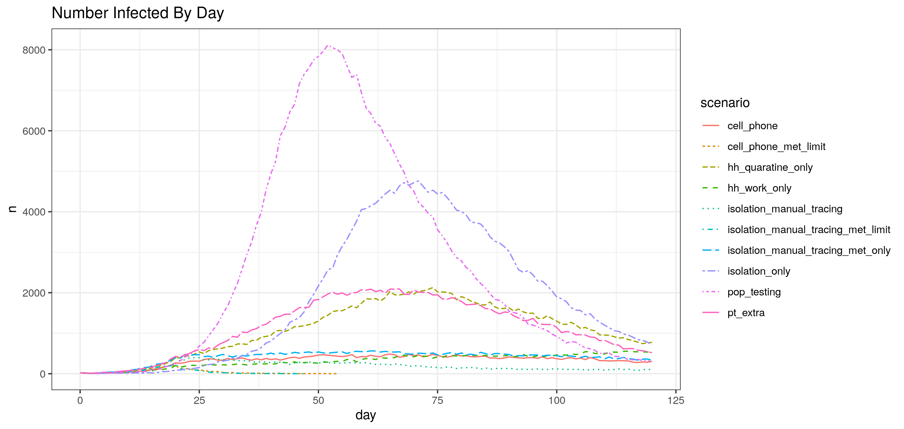
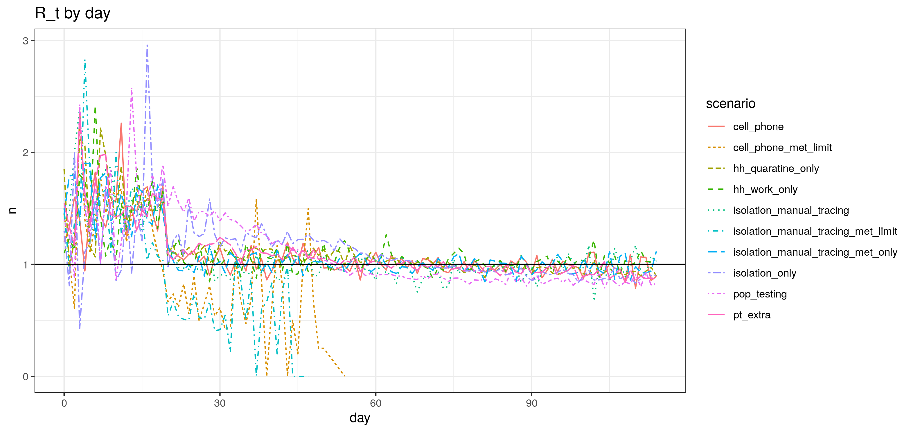
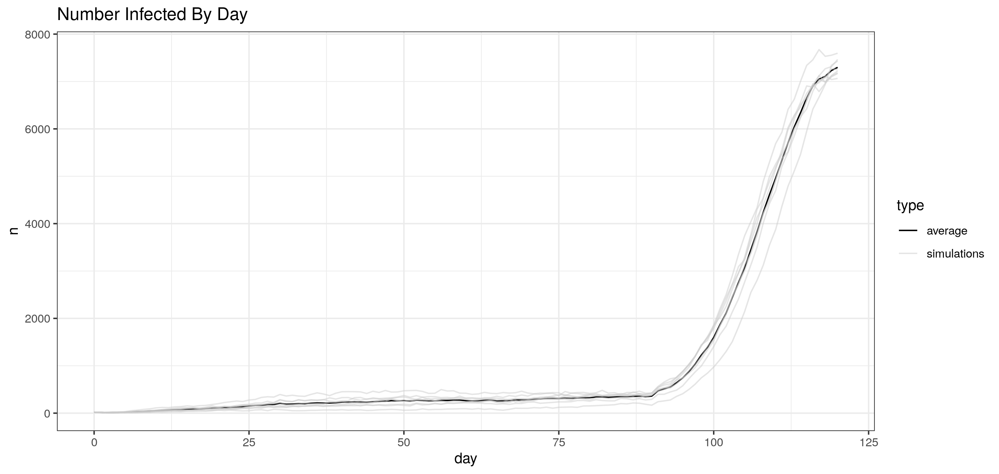

# Pandemic ABM

This repository contains an implementation of an **agent-based model (ABM)** of transmissible disease spread and prevention. This work is based on a paper by Kucharski et al and is actually a fork of the repo for that paper. The original code before the fork can be found in branch `before_fork`. This work extends this paper to a full-fledged ABM, tracking infection status and simulation social networks.

# Model Overview

The model simulates a population of agents divided in households and workplaces who interact (and expose each other to the disease) on a daily basis.



There are four types of agents based on their age group:
* children
* adults
* middle-aged
* pensioners

Every individual belongs to a **household**. The distribution of household in terms of age makeup and size is determined by the user.

Adults and Middle-aged agents are also assigned to **workplaces**. Children are asigned to 'classrooms' with other children. Pensioners are not assigned to a workplace.

The simulation progresses in 'days'. It begins with a small number of infected individuals defined by the user. Each day the infected agents interact with others who become exposed to infection:



I assume that the infected agent meets a number randomly drawn agents from their workplace as well as a number of randomly drawn agents from the population at large. The number of meetings is determiend for each infected agent by drawing an observation from the interaction dataset from the Pandemic study by Fry et al. Exposed agents face a certain user-defined probability of becoming infected (see section on default parameters).

I assume that infected agents also expose *everyone* from their own household (at least in the baseline scenario with no interventions). Exposed household members also face a user-defined probability of becoming infectious. For convenience this exposure is done on day 1 of the infection, so this probability should be thought of as the total probability that an exposed household member gets infected throughout the infectious period.

The next day the newly infected agents are added to the list of disease-spreaders and the simulation is carried over again. A simple *SIR status is kept for each agent:


This means that as the disease progresses, the number of susceptible individuals in the population, but also in individual households and workplaces will decrease, and the disease will naturally slow down at some point (note: this will tend to happen earlier because of the compartmentalisation of agents into households and workplaces compared to a simulation without this complication).

Throughout the simulation a record is kept of who infected who when. This allows us to compute the **effective average reproduction number** at each time point.

The basic interaction rules described above can be altered by specifying a disease-preventing non-pharmaceutical intervention, which I will cal 'policies' for short. 

The list of available policies is given below. It is the same set of interventions as in Kucharski et al.

* **no_measures** - the baselien scenario.
* **isolation_only** - individuals who test positive are isolated and can no longer infect. Only a fraction of infectious agents will get tested each day.
* **hh_quarantine_only** - in addition to the above, individuals in the household of the ones who tested positive are traced, tested and isolated if needed (i.e. they don't contribute to spreading the infection further).
* **hh_work_only** - as above plus same treatment of coworkers.
* **isolation_manual_tracing_met_only** - all contacts are traced (household, work and other) as long as they were contact known to the infected individual beforehand (this is an adjustable parameter). The idea is that in manual tracing you cannot trace stranger.
* **isolation_manual_tracing_met_limit** - same as above but also imposing a hard limit on number of social interaction outside the household or work (akin to social distancing measures)
* **isolation_manual_tracing** - assume every contact can be traced (including those that were strangers to the infected individual)
* **cell_phone** - tracingn using smartphone app. Same as isolation_manual_tracing (phone apps allow to trace strangers) but limited by number of people owning a phone.
* **cell_phone_met_limit** - same as above plus a hard limit on outside of work and home interactions.
* **pop_testing** - random testing on a certain fraction of the population each day and isolation of those who tested positive only (a la Romer)
* **pt_extra** - as far as I understand an umbrella for any intervention that reduces the chance of infection given exposure (e.g. mandatory mask wearing). The degree of reduction is a paramter in the model.

# Possible Future Extensions

Obviously some aspects of diease spread are simplified in this model. However some complications can be introduced relatively easily. Namely the duration of the disease is currently fixed but can be made variable and dependent on age. SIR groups can be agumented with additional status groups to model hospital admission, ICU care, death or lose of immmunity (and the transition between groups can be made dependent on age).

# Code Structure
The main functions of the model can be found in `R/model_abm_functions.R`. The file `R/plot_abm_functions.R` contains some auxiliery functions related to plotting. `R/model_functions.R` contains the original unaltered code by Kucharski et al. For any function type `?func_name` for a short (really short) description of what it does (provided that you have loaded the `docstring` package).

The following R libraries are required to run the code (see detailed info about versions in the end of the readme):

```
library(dplyr)
library(readr)
library(purrr)
library(furrr)
library(tidyr)
library(ggplot2)
library(docstring)
```
TODO: make docker image?

# Example
I will give a short example of how to use the model and the code. It is the same one that can be foun in the file `scripts/contact_abm_model.R`

## Defining social behaviour of each age group

Each age group in the model meets with other people based on interaction data such as the one provided by Fry et al. The first step is to define this interaction distribution:

```
# load contacts data
contacts <- bind_rows(
  read_csv("data/contact_distributions_u18.csv") %>%
    mutate(age = "student"),
  read_csv("data/contact_distributions_o18.csv") %>%
    mutate(age = "adult"),
  read_csv("data/contact_distributions_o18.csv") %>%
    mutate(age = "middle_age"),
  read_csv("data/contact_distributions_o18.csv") %>%
    mutate(age = "pensioner") %>%
    mutate(e_work = 0) # pensioners don't work
)
```

This is a little coarse since I only have data for over/under 18 rather than for more detailed age brackets, but this can be remedied in the future

## Creating a population of agents

The next step is to create a population of agents for the model. This is done by listing household types and the number of such households to include in the simulation.

```
# define initial population
init_pop <- generate_population(
  household_distribution = list(
    tibble(n = 100000, student = 0, adult = 2, middle_age = 0, pensioner = 0),
    tibble(n = 100000, student = 1, adult = 2, middle_age = 0, pensioner = 0),
    tibble(n = 10000, student = 2, adult = 2, middle_age = 2, pensioner = 2),
    tibble(n = 50000, student = 0, adult = 0, middle_age = 0, pensioner = 2)
  ),
  average_workplace_size = 40,
  average_classroom_size = 25
)
```

In principle this should be available from census data.

We also need to define the number of initial infected individuals in each age group:

```
# define initial infected individuals
init_inf <- generate_initial_infected(
  init_pop,
  n_initial_infections = c(
    "student" = 5,
    "adult" = 5,
    "middle_age" = 5,
    "pensioner" = 5    
  ),
  contact_distribution = contacts
)
```

## Simulating outbreaks

The main workhorse function of the model is `simulate_pandemic_policy_sequence`. It takes the initial population defined above and simulates a sequence of different intervention policies for a specified number of days. 

Below I simulate the baseline policy for $120$ days. Note the format of the `policy_sequence` parameter.

```
simulation_baseline <- simulate_pandemic_policy_sequence(
  initial_population = init_pop,
  initial_infected = init_inf,
  initial_recovered = tibble(individual_id = "")[0,],
  policy_sequence = list(list(scenario = "no_measures", n_days = 120)),
  contact_distribution = contacts
)
```
The code is somewhat time consuming, with this simulation loop taking around 11-12 minutes on my personal laptop.

The resulting data allows us to plot the different **SIR** groups throught time:



Or just the number of infected individuals at each day:

.

Finally we can plot the effective reproduction number at each day (the plot is noisy in the beginning and end of the simulation due to having only a few infected individuals at those times):



## Simulating the effect of different interventions

To compare different interventions, I will run one simulation for each intervention scneario, where first the disease spreads unchekced for $20$ days and then the intervention is put in place for $100$ days:

```
simulation_all_scenarios <- c(
  "isolation_only","hh_quaratine_only","hh_work_only",
  "isolation_manual_tracing_met_only","isolation_manual_tracing_met_limit",
  "isolation_manual_tracing","cell_phone","cell_phone_met_limit",
  "pop_testing","pt_extra"
) %>%
  future_map(function(scn) {
    simulate_pandemic_policy_sequence(
      initial_population = init_pop,
      initial_infected = init_inf,
      initial_recovered = tibble(individual_id = "")[0,],
      policy_sequence = list(
        list(scenario = "no_measures", n_days = 20), # assume 20 days before measures are taken
        list(scenario = scn, n_days = 100) # let simulation run for total of 120 days
      ),
      contact_distribution = contacts
    )
  })
```

We can now compare the total number of infected (with possible implications for the burden to the healthcare system) for each scenario:



The plot clearly shows that some policies are much more effective than others and some can even lead to disease erradication in these simulations. This is furthers confirmed by looking at $R_t$ for each simulatuion and noting that it falls well below $1$ for some of them (the plot is noisy at times because of the low number of infected agents at the beginning and end of disease spread):



## Multiple simulations and non-trivial policy schedules

The above plots show the results of running the simulation only once per scenario. Since there is inherent randomness in such models, it is better to conduct several simultions and average the results. This can be done through the `simulate_pandemic_policy_sequence_ntimes` function, which as the name suggests is just a wrapper aroung `simulate_pandemic_policy_sequence` that repeats the simulation for a specified number of times.

```
simulation_specific_policy <- simulate_pandemic_policy_sequence_ntimes(
  initial_population = init_pop,
  initial_infected = init_inf,
  initial_recovered = tibble(individual_id = "")[0,],
  policy_sequence = policy,
  n_times = 8, # run 8 simulations of the same policy
  contact_distribution = contacts
)
```

One can also use this model to simulate an arbitrary sequence of intervention policies (e.g. a regime of on-and-off social distancing or a policy of initial manual tracing later replaced by cell phone tracing).

To do this just define a `policy` list as the one below (specifying the duration in days of each policy):

```
policy <- list(
  list(scenario = "no_measures", n_days = 10),
  list(scenario = "hh_quaratine_only", n_days = 20),
  list(scenario = "hh_work_only", n_days = 20),
  list(scenario = "isolation_manual_tracing_met_only", n_days = 20),
  list(scenario = "cell_phone", n_days = 20),
  list(scenario = "pop_testing", n_days = 30)
)
```

Plotting the outputs of `simulate_pandemic_policy_sequence_ntimes` will show the result of each simulation as well as the average across simulations:



# Default simulation parameters

```
inf_period = 5, # Infectious period
max_low_fix = 4, # Social distancing limit in scenarios with hard limit
wfh_prob = 0, # Probability people are working from home
trace_prop = 0.95, # Proportion of contacts traced 
app_cov = 0.53, # App coverage
prob_symp = 0.6, # Proportion symptomatic
prob_t_asymp = 0.5, # Transmission probability if asymptotic
isolate_distn = c(0,0.25,0.25,0.2,0.3,0), # distribution of time to isolate in the scenarios with isolation (1st day presymp)
pt_extra = 0, # Optional extra transmission intervention probability
pt_extra_reduce = 0, # Reduction from extra intervention
hh_risk = 0.2, # HH risk (total)
cc_risk = 0.06, # Outside HH contact risk (per daily exposure)
trace_adherence = 0.9, 
p_pop_test = 0.05, # Proportion mass tested (5% per week)
trace_hh = 1, # Proportion of household members traced in scenarios involving tracing.
met_before_w = 0.79, # Proprotion of meetings which are with familiar people at work. At school = 90%
met_before_h = 1, # Within HH
met_before_o =  0.52 # In other settings
```

# R And R Packages Info

```
R version 3.6.0 (2019-04-26)
Platform: x86_64-pc-linux-gnu (64-bit)
Running under: Ubuntu 18.04.2 LTS

Matrix products: default
BLAS:   /usr/lib/x86_64-linux-gnu/blas/libblas.so.3.7.1
LAPACK: /usr/lib/x86_64-linux-gnu/lapack/liblapack.so.3.7.1

locale:
 [1] LC_CTYPE=en_US.UTF-8       LC_NUMERIC=C               LC_TIME=bg_BG.UTF-8        LC_COLLATE=en_US.UTF-8    
 [5] LC_MONETARY=bg_BG.UTF-8    LC_MESSAGES=en_US.UTF-8    LC_PAPER=bg_BG.UTF-8       LC_NAME=C                 
 [9] LC_ADDRESS=C               LC_TELEPHONE=C             LC_MEASUREMENT=bg_BG.UTF-8 LC_IDENTIFICATION=C       

attached base packages:
[1] stats     graphics  grDevices utils     datasets  methods   base     

other attached packages:
[1] docstring_1.0.0 ggplot2_3.3.0   tidyr_0.8.3     furrr_0.1.0     future_1.17.0   purrr_0.3.4     readr_1.3.1     dplyr_0.8.5    

loaded via a namespace (and not attached):
 [1] Rcpp_1.0.4.6     pillar_1.4.3     compiler_3.6.0   tools_3.6.0      digest_0.6.25    evaluate_0.14    lifecycle_0.2.0 
 [8] tibble_3.0.1     gtable_0.3.0     pkgconfig_2.0.2  rlang_0.4.5      rstudioapi_0.11  commonmark_1.7   yaml_2.2.1      
[15] parallel_3.6.0   xfun_0.13        xml2_1.2.0       stringr_1.4.0    roxygen2_6.1.1   withr_2.1.2      knitr_1.28      
[22] vctrs_0.2.4      globals_0.12.5   hms_0.4.2        grid_3.6.0       tidyselect_0.2.5 glue_1.4.0       listenv_0.8.0   
[29] R6_2.4.0         rmarkdown_2.1    magrittr_1.5     scales_1.0.0     codetools_0.2-16 ellipsis_0.2.0   htmltools_0.4.0 
[36] rsconnect_0.8.16 assertthat_0.2.1 colorspace_1.4-1 stringi_1.4.6    munsell_0.5.0    crayon_1.3.4   
```
